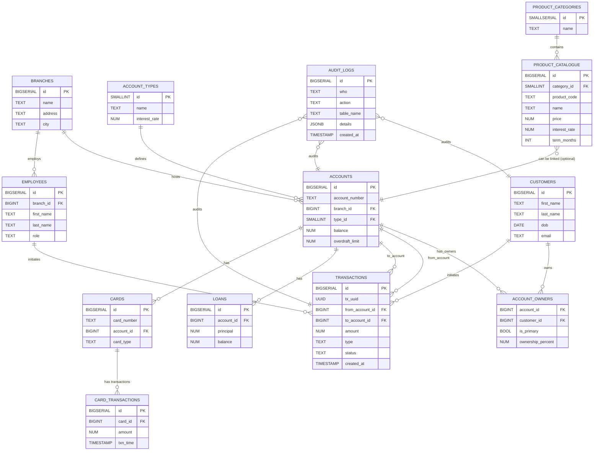

# Bank Schema ERD (Mermaid)

Notes:
- Render this with a Mermaid-capable renderer (e.g., VS Code Mermaid Preview or GitHub Markdown).
- The diagram shows primary keys (PK) and foreign keys (FK) and cardinality hints.
